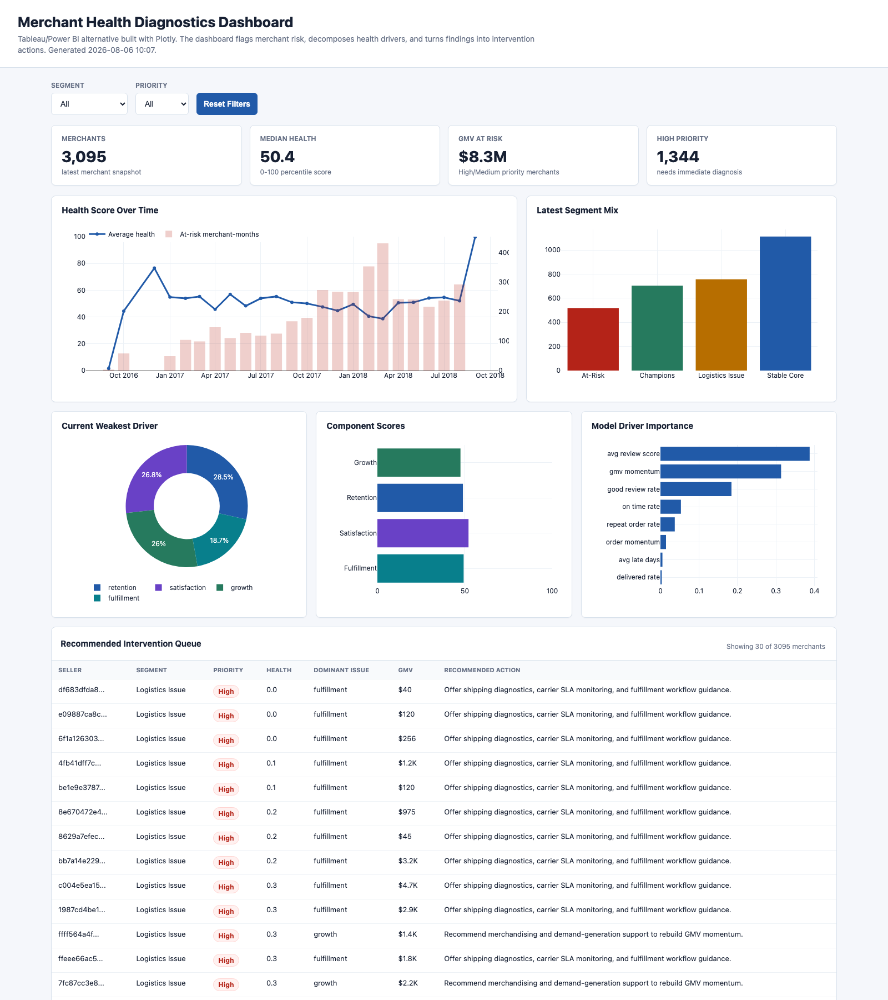

# Merchant Health Diagnostics & Intervention Framework

This repository implements a merchant health decision system for a marketplace product team. It uses public Olist marketplace data as a proxy environment to define merchant health, diagnose risk drivers, recommend interventions, and plan a 30-day measurement loop.

Live dashboard: https://junyichen1633.github.io/Merchant-Health-Diagnostics-Intervention-Framework/docs/index.html



## Business Problem

Marketplace teams need to know which merchants are likely to create poor buyer experiences, lose momentum, or require product support. A static merchant ranking is not enough: PMs and operators need to understand why a merchant is unhealthy and what action should happen next.

This project answers five product questions:

1. Which merchants are currently healthy, watch-listed, or at risk?
2. Which driver explains the risk: fulfillment, satisfaction, retention, or growth?
3. Which merchants should be prioritized first based on health, trend, and GMV exposure?
4. What product intervention should be recommended for each merchant?
5. How should the team evaluate whether the intervention improved health after 30 days?

## Metric Design

The core analytical grain is merchant-month:

```text
seller_id + order_month
```

The pipeline first collapses order-item data to the order-seller grain so review and customer signals are not duplicated when an order contains multiple items.

Merchant health is measured through four interpretable components:

- Fulfillment: delivered rate, on-time rate, average late days.
- Satisfaction: average review score, good-review rate.
- Retention: repeat order rate from buyers returning to the same merchant.
- Growth: GMV momentum and order-count momentum.

The primary score design is `business_calibrated_v1`:

- Fulfillment: 30%
- Satisfaction: 35%
- Retention: 15%
- Growth: 20%

This design gives the most weight to buyer experience signals because they are actionable product levers and leading indicators of marketplace quality. Retention remains an outcome metric, but its weight is lower because repeat purchase is sparse in Olist and should not dominate the score without stronger merchant lifecycle data.

The pipeline also runs sensitivity checks across alternative designs:

- `balanced`
- `experience_led`
- `retention_led`
- `growth_led`

The sensitivity output reports rank correlation, at-risk overlap, median score movement, and p90 score movement. This makes the metric governable: a PM can see whether merchant prioritization is stable when reasonable business assumptions change.

## Decision Framework

The framework turns metrics into product decisions:

1. Score each merchant-month on the four health components.
2. Convert the primary health signal into a 0-100 percentile score and health band.
3. Compute month-over-month component deltas to explain health drops.
4. Assign the current weakest component as the dominant issue.
5. Segment the latest merchant snapshot into business-readable groups.
6. Recommend an intervention playbook based on the dominant issue.
7. Estimate expected 30-day health lift and define the measurement plan.

Intervention priority is based on current health and recent deterioration:

- High: severe current risk or sharp recent health decline.
- Medium: watch-list risk or moderate decline.
- Low: stable merchants that should be monitored or used as benchmarks.

The 30-day evaluation layer is a planning estimate, not a claimed experiment result. It uses the observational health-driver model plus bounded product assumptions to estimate expected lift, then recommends a matched-control or staggered-rollout readout.

## Dashboard

The interactive dashboard is built as a static Plotly HTML file, so it works as a Tableau or Power BI alternative without requiring local BI software.

Local dashboard:

```bash
python3 scripts/build_dashboard_html.py
```

Open:

```text
dashboard/merchant_health_dashboard.html
```

Published dashboard:

```text
https://junyichen1633.github.io/Merchant-Health-Diagnostics-Intervention-Framework/docs/index.html
```

Dashboard views:

- Merchant risk KPIs and GMV at risk.
- Health score trend over time.
- Latest segment mix.
- Weakest driver distribution.
- Component score comparison.
- Model driver importance.
- 30-day intervention evaluation.
- Health score sensitivity.
- Recommended intervention queue.

## Product Recommendations

The strongest product signal is that delivery delays are associated with lower review scores and lower merchant health. The recommended product direction is a merchant intervention system that routes merchants to driver-specific actions:

- Fulfillment issue: shipping diagnostics, carrier SLA monitoring, and fulfillment workflow guidance.
- Satisfaction issue: product quality, listing accuracy, and post-purchase support review.
- Retention issue: lifecycle campaigns, win-back offers, and loyalty tooling.
- Growth issue: merchandising support, demand-generation prompts, and assortment guidance.

The dashboard should be used as an operating loop:

1. Detect merchant risk.
2. Diagnose the dominant issue.
3. Trigger the recommended playbook.
4. Re-measure health after 30 days against a matched control or rollout holdout.
5. Promote interventions that lift health without hurting guardrail metrics.

## Limitations

- Olist is public marketplace data, not internal Shopify data.
- Subscription churn, merchant support tickets, app adoption, and actual intervention assignments are not observed.
- Repeat purchase is very sparse, so retention should be interpreted carefully.
- Regression outputs are observational and should be described as associations, not causal proof.
- The 30-day intervention lift is a decision-planning estimate until validated with an experiment or quasi-experiment.

## Future Work

- Replace proxy features with Shopify merchant lifecycle data.
- Add merchant subscription status, app adoption, support tickets, and fulfillment-provider data.
- Validate intervention impact with a randomized rollout, geo/category holdout, or matched historical cohort.
- Add confidence intervals for expected 30-day lift.
- Build a monitoring job that refreshes merchant health monthly and flags metric drift.

## How To Run

Raw Olist CSV files are not included in this repository. Download the Olist Brazilian E-commerce dataset from Kaggle and place the required files in `Dataset/`. See `Dataset/README.md` for the file list.

```bash
pip install -r requirements.txt
```

```bash
python3 src/run_pipeline.py
```

```bash
python3 scripts/build_dashboard_html.py
```

Main generated outputs:

- `outputs/merchant_month_metrics.csv`
- `outputs/merchant_health_scores.csv`
- `outputs/merchant_segments.csv`
- `outputs/driver_feature_importance.csv`
- `outputs/regression_summaries.csv`
- `outputs/health_score_sensitivity.csv`
- `outputs/intervention_evaluation_plan.csv`
- `outputs/intervention_evaluation_summary.csv`
- `dashboard/merchant_health_dashboard.csv`
- `dashboard/merchant_interventions.csv`
- `dashboard/merchant_health_dashboard.html`
- `docs/index.html`

Generated CSV outputs are excluded from GitHub so the repository stays lightweight and reproducible. The static dashboard HTML is included for review.
